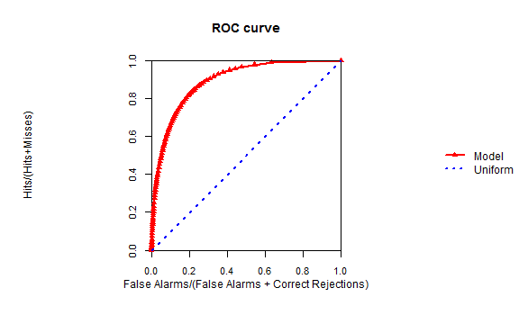

## Purpose of the TOC Shiny App

The TOC R Shiny web application allows the construction 
of the Receiver Operating Characteristic (ROC) curve and 
the Total Operating Characteristic (TOC) curve for spatial 
and non-spatial data through a graphical user interface.

- <strong style="font-weight: bold">What is ROC?</strong>

The ROC curve is a widely-popular statistical technique 
used for evaluating the performance of a binary classifier 
system as its discrimination threshold is varied. 

- <strong style="font-weight: bold">What is TOC?</strong>

The TOC method is a novel modification of the ROC method 
aimed to provide more bits of information than the ROC
curve (<a href="https://www.researchgate.net/publication/271800748_The_total_operating_characteristic_to_measure_diagnostic_ability_for_multiple_thresholds">Pontius and Kangpin 2014</a>).

--- .class #id 

## What are the applications of an ROC (or TOC) curve?

ROC curves are used to evaluate the performance of diagnostic tests. For example, they have been used for:

- Determining a cutoff value for a clinical test in medicine (<a href="http://www.ncbi.nlm.nih.gov/pmc/articles/PMC2698108/#">Park et al., 2004</a>).
- Assessing the performance of classification algorithms, such as those used for predicting structures and functions from sequence data (<a href="http://intl-bib.oxfordjournals.org/content/9/3/198.full">Sonego et al., 2008</a>).
- Examining the reliability of sensor-based estimates of of human interruptibility in office
environments (<a href="https://homes.cs.washington.edu/~jfogarty/publications/gi2005.pdf">Fogarty et al., 2005</a>).

--- .class #id 

## How to use the TOC Shiny app?

1. Go to: https://amsantac.shinyapps.io/TOCapp.
2. Download the sample data available in the 'How To' tab in the 'Spatial' menu for working with spatial data. Also see the 'Non-spatial' menu for non-spatial data.
3. Unzip the downloaded file and follow the instructions given in the 'How To' tab.
5. You will see the output curves, tables and maps in the 'Plots', 'Tables' and 'Maps' tabs.

 

--- .class #id 

## Recomendations

- This app is under development. Results are not guaranteed.
- Use a small number of thresholds, e.g. 10. A greater number of thresholds may take longer time for processing. Parallelization will be implemented in the near future to improve performance.
- Plots, tables and maps display may take some seconds, so please be patient.
